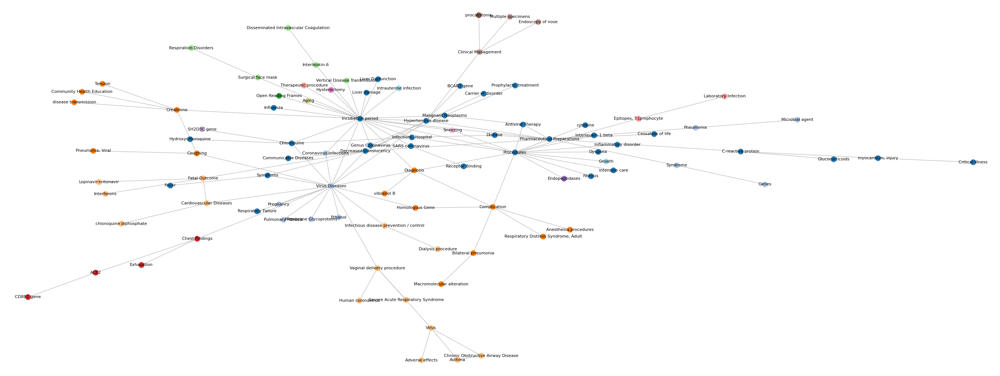
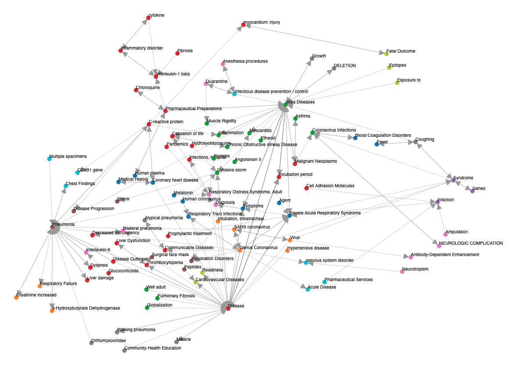

# Medical Knowledge Discovery and Representation

The rate at which machine-based and human-generated data is created has increased exponentially. However the majority of them is in unstructured form, limiting the applicability of algorithms of supervised machine learning. Unsupervised algorithms, on the other hand, play a crucial role in the analysis of unstructured, unlabeled data and it is especially true when it comes to text analysis.

One of the areas that is currently undergoing a rapid development is medical literature knowledge discovery. Learning the features of an unstructured text and summarizing them in a structured graph, usually referred to as “Knowledge Graph”, provides the means for not only easier understanding of the medical knowledge but also allows for extracting relations unknown beforehand.

## Covid-19
The recent outbreak of COVID-19 sparked tremendous response by scientific and medical community.
This resulted in a rapid growth of research and clinical studies. However, making sense of this gamut of
scientific publications may be hindered by inabilities to access and analyze their free-form text contents
from the perspectives of information relevance and reliability.  
 
The project consists of the following key milestone to address this accessibility bottleneck related to the
rapidly evolving body of COVID-19 research:  A causal graph constructing application to extract medical
knowledge from available academic biomedical and engineering literature.

## Retrieving articles and storing locally

The script `crawler.py` makes use of the [Entrez utilities](https://www.ncbi.nlm.nih.gov/books/NBK25501/) to perform a query to the PubMed database, with query keyword defined inside. For each article found is allocated an `Article` object, defined in `article.py`, that collects: abstract, title, author, date, journal and keywords list.

The results then are stored both in xml format (`DATA/xml/`), and json format (`elasticsearch/json/`) for indexing with [Elasticsearch](https://www.elastic.co/elasticsearch/?ultron=[EL]-[B]-[EMEA-General]-Exact&blade=adwords-s&Device=c&thor=elasticsearch&gclid=CjwKCAjw4KD0BRBUEiwA7MFNTRoenvM2EUFuTKmBWXtWcutsi3sMsud182ucINUSKZe240O-kl9WwRoCRG8QAvD_BwE). The task is parallelized across the available threads using python `multiprocessing` module.

### Requirements

```
requests
Beautifulsoup
multiprocessing
```

## Preprocessing 

`preprocessor.py` implements a `Preprocessor` object that is used to load data from the xml generated at the previous step, or simply to preprocess raw text. Text is splitted in paragraphs and sentences, optionally also tokenization (with regex), stop words removal and lemmatization (with [nltk](https://www.nltk.org/)) can be performed. Again `multiprocessing` is used to parallelize the task across the available threads.

### Requirements

```
re
Beautifulsoup
multiprocessing
nltk
```

### Usage

Load an xml file generated by `crawler.py` and write the result to `out_file`
```
p = Preprocessor(load='path-to-file.xml', out_file='path-to-out-file.txt')
```
or simply feed some raw text
```
p = Preprocessor(text=some_text, out_file='path-to-out-file.txt')
```
then perform preprocessing
```
p.preprocess(tokenize=True, remove_stop=True, lower=True, lemma=True)
```
only sentence splitting is performed by default.

## Causal graph

Here we use [SemRep](https://github.com/lhncbc/SemRep) to extract predications from the abstracts collected with `crawler.py`. The bash script `predicates.sh` takes as argument a raw text file with one sentence per line (can be generated using `Preprocessor` for example)
```
sh predicates.sh example.txt
```
and generates the `predicates.xml` file containing all the predications found by SemRep. The task is splitted in batches of 100 sentences and runs parallel thanks to [GNU Parallel](https://www.gnu.org/software/parallel/).

Then, the file containing predications is parsed to extract all the subject-predicate-object tuples and the graph is built using `Graph` object implemented in `graph.py` (based on python modules [graph_tool](https://graph-tool.skewed.de/) and [networkx](https://github.com/networkx/networkx)).

Here an example about covid-19




### Requirements

```
SemRep
GNU Parallel
graph_tool
Beautifulsoup
keras
matplotlib
numpy
sklearn
```

### Usage

The graph can be created by passing a list of `Vertex` objects

```
from graph import Vertex, Networkx, Graph_tool

vertex = Vertex('Source', ['CAUSES', 'COEXIST_WITH'], ['Target 1', 'Target 2'])
g = Networkx(vertices=[vertex])
```

or

```
g = Graph_tool(vertices=[vertex])
```

To keep only causal relations, simply call `g.causal()`

Node embedding and clustering can be performed (note that embedding is required for clustering)

```
embedding = g.deep_walk()
clustering = g.k_means(elbow_range=(2,10))
```

finally call `g.draw()` to visulaize the graph.


## Team
- Andrea Papaluca   (ANU, PhD applicant).

- Artem Lenskiy     (ANU, Research Fellow).

- Daniel Krefl      (Lausanne U., Assistant Professor)

- Hanna Suominen    (ANU, Associate Professor)
